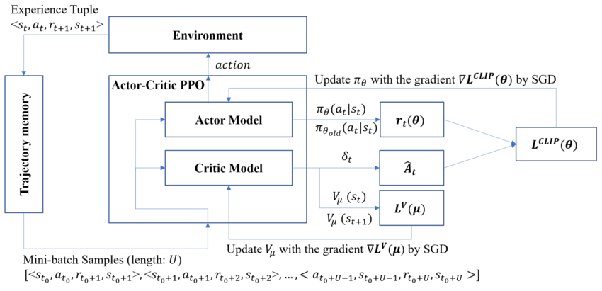

## Proximal Policy Optimization (PPO)

Proximal Policy Optimization, or PPO, is a **policy gradient** algorithm used in reinforcement learning. It's an **actor-critic** method that has become a default choice for many RL problems due to its excellent balance of performance, stability, and ease of implementation.

PPO's main goal is to solve the biggest problem in policy gradient methods: how to take the largest possible improvement step on a policy without it being so large that it collapses performance. It achieves this by constraining the policy update at each training step.

***

### Core Concepts

To understand PPO, we first need to know these concepts:

* **Policy ($\pi$)**: The agent's strategy, which maps a state to an action. In PPO, this is a neural network called the **Actor**.
* **Value Function ($V(s)$)**: A function that predicts the expected future reward from a state $s$. This is a second neural network called the **Critic**.
* **Advantage Function ($A(s, a)$)**: This function measures how much better a specific action $a$ is compared to the average action in a state $s$. It's calculated as:
    $A^{\pi}(s, a) = Q^{\pi}(s, a) - V^{\pi}(s)$
    * If $A > 0$, the action was better than average.
    * If $A < 0$, the action was worse than average.
    Using the advantage function helps stabilize training by reducing high variance in the gradient updates.

***

### The PPO Innovation: Clipped Surrogate Objective

Standard policy gradient methods can be very sensitive. A single bad update can lead to a "bad" policy that gathers poor data, causing a catastrophic performance collapse. PPO prevents this by ensuring the new policy doesn't stray too far from the old one. It does this with a special "clipped" objective function.

Let's break it down:

1.  **The Probability Ratio ($r_t(\theta)$)**: First, PPO calculates the ratio between the action probability of the **new policy** ($\pi_{\theta}$) and the **old policy** ($\pi_{\theta_{old}}$) that was used to collect the data.

    $$
    r_t(\theta) = \frac{\pi_{\theta}(a_t|s_t)}{\pi_{\theta_{old}}(a_t|s_t)}
    $$

2.  **The Clipped Objective ($L^{CLIP}$)**: The core of PPO is its objective function, which takes the minimum of two terms:

    $$
    L^{CLIP}(\theta) = \mathbb{E}_t \left[ \min\left( r_t(\theta) \hat{A}_t, \quad \text{clip}(r_t(\theta), 1 - \epsilon, 1 + \epsilon) \hat{A}_t \right) \right]
    $$

    * $\hat{A}_t$ is the estimated advantage at time $t$.
    * $\epsilon$ (epsilon) is a small hyperparameter (e.g., 0.2) that defines the "clipping" range.
    * The `clip` function forces the probability ratio $r_t(\theta)$ to stay within the range $[1 - \epsilon, 1 + \epsilon]$.

This `min` function creates a pessimistic, lower-bound on the policy improvement. Here's how it works:

* **When Advantage is Positive ($\hat{A}_t > 0$)**: The action was good. The policy is encouraged to increase its probability. The `clip` function puts a **cap** on this increase. The ratio $r_t(\theta)$ cannot exceed $1+\epsilon$, which prevents the policy update from being too large.

* **When Advantage is Negative ($\hat{A}_t < 0$)**: The action was bad. The policy is encouraged to decrease its probability. The `clip` function puts a **floor** on this decrease. The ratio $r_t(\theta)$ cannot go below $1-\epsilon$, preventing an overly aggressive update that might destabilize the policy.

By taking the minimum of the normal objective and the clipped objective, PPO ensures it never makes a dangerously large policy change.

***

### ## The Full Algorithm

The final PPO algorithm combines the clipped objective with two other components:

1.  **Value Function Loss ($L^{VF}$)**: A standard mean-squared error loss to train the critic network.
2.  **Entropy Bonus ($S$)**: A term to encourage exploration by rewarding the policy for being more random.

The full objective function is:

$$L(\theta) = L^{CLIP}(\theta) - c_1 L^{VF}(\theta) + c_2 S[\pi_{\theta}](s_t)$$

The training loop proceeds as follows:

1.  **Collect Data**: The current policy (the Actor) runs in the environment for a set number of steps, collecting states, actions, and rewards.
2.  **Compute Advantages**: For each step, compute the advantage estimates $\hat{A}_t$ and the value targets using the collected data.
3.  **Optimize**: For several epochs, update the policy and value networks using the PPO objective function and the collected data.
4.  **Repeat**: Discard the old data and repeat the process from step 1.

